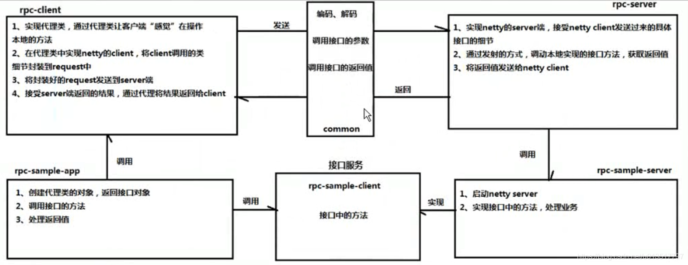
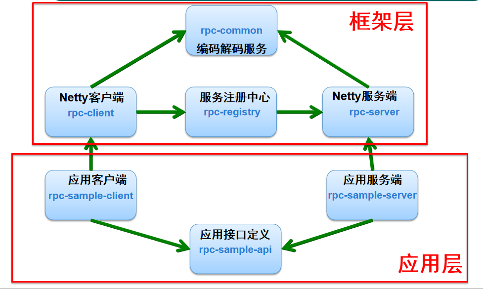

# rpc-framework
## rpc-framework框架基本结构
设计的RPC框架的基本机构如下图：

该图从宏观上来看，下面一层是我们的应用程序层，上面一层是我们将要开发的框架。
在应用层客户端rpc-sample-client，需要调用远端(server)的业务实现方法，远端由业务服务rpc-sample-server提供业务的实现方法。
### 1. 客户端
在应用层客户端rpc-sample-app中，首先创建代理类的对象，获取接口对象，然后调用接口方法，就好像是直接调用本地类一样，来调用远端的服务，例如：
``` 
UserService userService = rpcProxy.create(UserService.class);
User user = userService.getUserById(1);
```
而这其中的“Proxy”代理类实现了Netty的client，封装请求至request，然后发送到server，接受server返回的结果，然后将结果返回到client，代理接口直接返回结果。
上面的一系列操作，客户是感觉不到的，只需要一个注解之类的东西，将代理类接口注入，直接使用，像是直接调用了本地编写的UserService一样。
### 2. 中间层
数据在发出以及在接收的时候，需要进行编码和解码，此时就需要一个中间层来对即将要发送方的信息(调用接口的参数)编码，将收到的信息(调用接口的返回值)进行解码。
### 3. 服务端
在服务端的信息处理框架层， 实现了Netty的Server端，接收client的request信息，解析信息，通过反射的方式调用本地实现的接口方法，获取返回值。最后将返回值发送给Netty的client端。
调用上面框架的应用层，只需要实现接口中的方法，处理具体业务即可，无需关心远程调用的过程。对外暴露服务只需要启动Netty的Server即可。
### 4. 注册中心
我们可能同时有许多服务提供端，也有许多服务接口和调用的方法名，这些都需要一个类似房屋中介的机制来进行托管，以便于管理服务获取与暴露，以及合理分配资源，做客户端与服务端连接的桥梁

## 代码实现思路
1. rpc-client——实现了rpc的服务动态代理(RpcProxy)以及基于Netty封装的一个客户端网络层(RpcClient)
2. rpc-common——封装了RpcRequest和RpcResponse，即rpc请求和响应的数据结构、基于Netty提供了编解码器、提供了序列化反序列化等工具
3. rpc-registry——提供了服务发现和注册接口
4. rpc-registry-zookeeper——基于zookeeper的服务发现和注册接口
5. rpc-server——rpc服务器(RpcServer)的实现，用来监听rpc请求以及向Zookeeper注册服务地址、rpc服务本地调用
6. rpc-sample-api——rpc测试公共api服务接口
7. rpc-sample-client——rpc测试客户端
8. rpc-sample-server——rpc测试服务启动程序和服务实现


其中`rpc-client`、`rpc-common`、`rpc-registry/rpc-registry-zookeeper`、`rpc-server`为框架的实现部分，剩下的`rpc-sample-api`、`rpc-sample-client`、`rpc-sample-server`为调用框架的业务工程。
工程之间的调用关系如下图：


在框架层，`rpc-client`工程实现了Netty的客户端，封装请求至request，然后发送到server。而`rpc-server`工程实现了Netty的服务端，接收client的request信息，解析信息。然后两者需要连接注册中心，获取和暴露服务，所以需要连接`rpc-registry`注册中心实现模块。然后`rpc-client`和`rpc-server`的编码和解码由`rpc-common`实现。
在应用层，开发者只需要开发一个`rpc-sample-client`客户端，调用远程服务方法，然后开发一个`rpc-sample-server`服务端，实现暴露给其它应用的业务类方法的具体实现。两个工程均依赖`rpc-sample-api`工程定义的api服务接口规范进行服务的开发。同时`rpc-sample-client`和`rpc-sample-server`会接入`rpc-client`和`rpc-server`来实现远程服务调用和暴露的具体交互逻辑。
